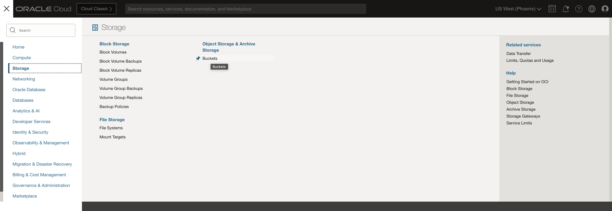
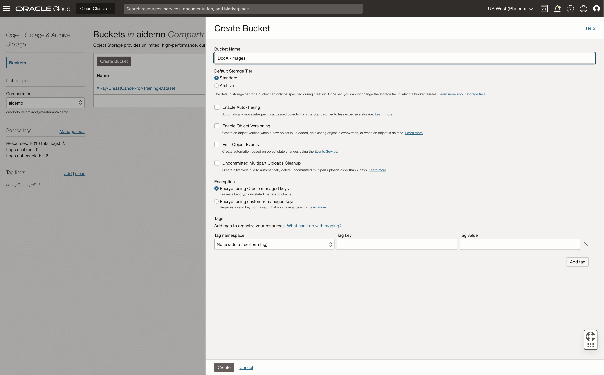
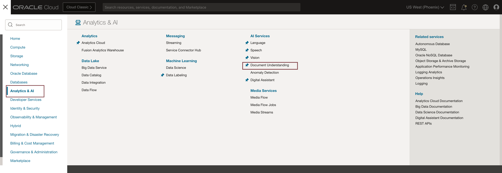
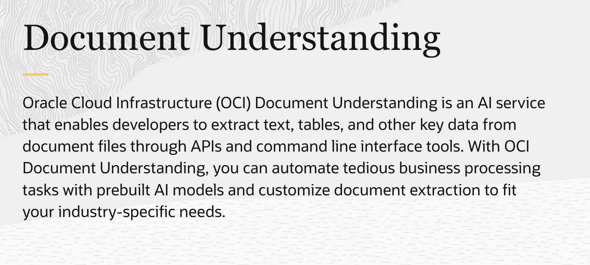
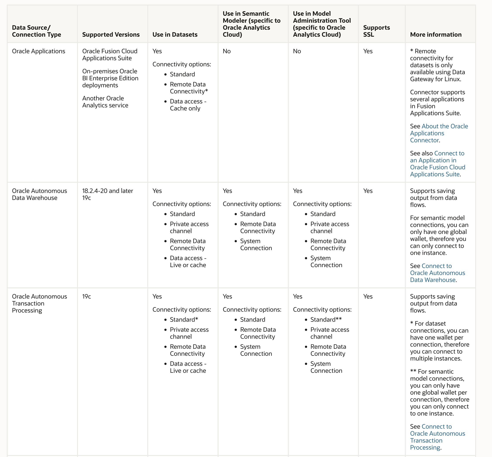
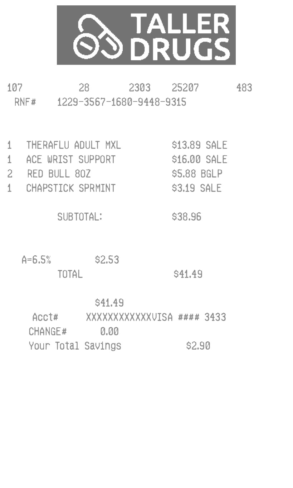
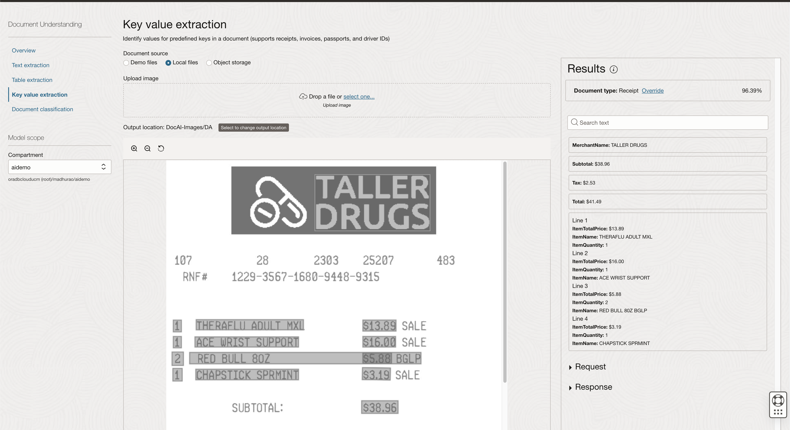
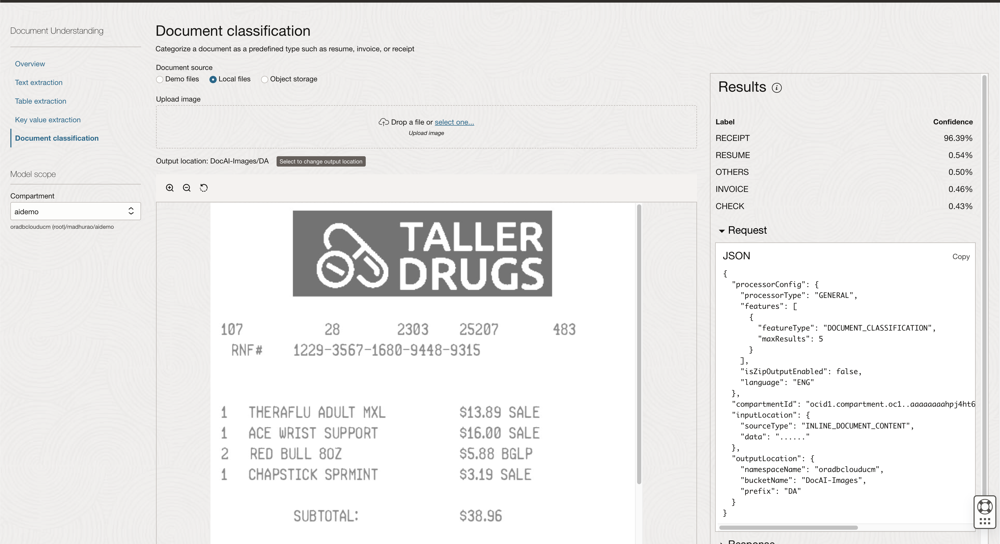

# Lab 9: Introduction to Pretrained Oracle Document AI Models

## Introduction

In this workshop, we will leverage Oracle Document Understanding to scan through a medical bill receipt and create an expense item. The expense approver can view the submitted expenses and approve or reject them.

Oracle Cloud Infrastructure Document Understanding is an AI service that enables developers to extract text, tables, and other key data from document files through APIs and command-line interface tools. With Document Understanding, you can automate tedious business processing tasks with prebuilt AI models and customize document extraction to fit your industry-specific needs.
 
Estimated Time: 20 minutes.
 
### About Pretrained Document AI Models

Document Understanding provides pretrained models that allow you to organize and extract text and structure from business documents.

Pretrained models let you use AI with no data science experience. Simply provide a file to the Document Understanding service and, without having to create your own model, get back information about your document. 

### Objectives

In this lab, you will use Document Understanding AI services for the following:
 
* Text Extraction
* Table Extraction
* Key Value Extraction
* Document classification
* Analyze the request and response JSON files

### Prerequisites

This lab assumes you have:

* Completed previous labs of this workshop: **Setup environment**, you have access to create OCI Bucket and Oracle Document Understanding AI services.

## Task 1: Create OCI Bucket

Login to cloud.oracle.com from the top left navigation and select bucket under the storage menu.



create a bucket under the compartment of your choice, we would need this bucket to upload temporarily files of document understanding
 


## Task 2: Text extraction

Document understanding services can be accessed under Analytics & AI Services from the top left navigation menu.



### Text extraction
 
Provides word-level and line level text as well as the bounding box coordinates of where the text is located. Optionally, you can create a searchable PDF which embeds a transparent layer on top of a document image in PDF format to make it searchable by keywords.

Select **Text Extraction** in the left navigation and upload this sample image 
 


Select **Local files**, and Upload any sample image that contains text to extract, for example, the image as shown below.
 


Once **Text Extraction** service is completed the response. The output will be as shown below.


The request and response JSON file will be as shown below

```json
    <copy>
    {
        "processorConfig": {
            "language": "ENG",
            "processorType": "GENERAL",
            "features": [
            {
                "featureType": "TEXT_EXTRACTION"
            }
            ],
            "isZipOutputEnabled": false
        },
        "compartmentId": "ocid1.compartment.oc1..aaaaaaaahpj4-yourocid-q-xjkjggpcxa",
        "inputLocation": {
            "sourceType": "INLINE_DOCUMENT_CONTENT",
            "data": "......"
        },
        "outputLocation": {
            "namespaceName": "ora-yourocid-ucm",
            "bucketName": "DocAI-Images",
            "prefix": "DA"
        }
    }
</copy>
```

Expand *Response* and observe the JSON response with prediction results.

```json
    <copy>
    {
        "documentMetadata": {
            "pageCount": 1,
            "mimeType": "image/png"
        },
        "pages": [
            {
            "pageNumber": 1,
            "dimensions": {
                "width": 1818,
                "height": 818,
                "unit": "PIXEL"
            },
            "words": [
                {
                "text": "Document",
                "confidence": 0.9585577,
                "boundingPolygon": {
                    "normalizedVertices": [
                    {
                        "x": 0.04070169933558297,
                        "y": 0.08561437928589166
                    },
                    {
                        "x": 0.322120993837665,
                        "y": 0.08901094282751852
                    },
                    {
                        "x": 0.32179527156817245,
                        "y": 0.20514692012721578
                    },
                    {
                        "x": 0.04015990740919795,
                        "y": 0.20175036591247708
                    }
                    ]
                }
                },
                {
                "text": "Understanding",
                "confidence": 0.9585577,
                "boundingPolygon": {
                    "normalizedVertices": [
                    {
                        "x": 0.33421293789535206,
                        "y": 0.08915688064687118
                    },
                    {
                        "x": 0.7431270653920861,
                        "y": 0.09409223150798919
                    },
                    {
                        "x": 0.7431245138674024,
                        "y": 0.21022820880768642
                    },
                    {
                        "x": 0.33389648168918457,
                        "y": 0.2052928672734566
                    }
                    ]
                }
                },
                {
                "text": "Oracle",
                "confidence": 0.97941506,
                "boundingPolygon": {
                    "normalizedVertices": [
                    {
                        "x": 0.0407040704070407,
                        "y": 0.3643031784841076
                    },
                    {
                        "x": 0.11276127612761276,
                        "y": 0.3643031784841076
                    },
                    {
                        "x": 0.11276127612761276,
                        "y": 0.4180929095354523
                    },
                    {
                        "x": 0.0407040704070407,
                        "y": 0.4180929095354523
                    }
                    ]
                }
                },
                {
                "text": "Cloud",
                "confidence": 0.97941506,
                "boundingPolygon": {
                    "normalizedVertices": [
                    {
                        "x": 0.11606160616061606,
                        "y": 0.3643031784841076
                    },
                    {
                        "x": 0.18811881188118812,
                        "y": 0.3643031784841076
                    },
                    {
                        "x": 0.18811881188118812,
                        "y": 0.4180929095354523
                    },
                    {
                        "x": 0.11606160616061606,
                        "y": 0.4180929095354523
                    }
                    ]
                }
                },
                {
                "text": "Infrastructure",
                "confidence": 0.97941506,
                "boundingPolygon": {
                    "normalizedVertices": [
                    {
                        "x": 0.1936193619361936,
                        "y": 0.3643031784841076
                    },
                    {
                        "x": 0.35753575357535755,
                        "y": 0.3643031784841076
                    },
                    {
                        "x": 0.35753575357535755,
                        "y": 0.4180929095354523
                    },
                    {
                        "x": 0.1936193619361936,
                        "y": 0.4180929095354523
                    }
                    ]
                }
                }, 
                {
                "text": "tasks with prebuilt Al models and customize document extraction to fit",
                "confidence": 0.9586959,
                "boundingPolygon": {
                    "normalizedVertices": [
                    {
                        "x": 0.039603960396039604,
                        "y": 0.6931540342298288
                    },
                    {
                        "x": 0.8773377337733773,
                        "y": 0.6931540342298288
                    },
                    {
                        "x": 0.8773377337733773,
                        "y": 0.7469437652811736
                    },
                    {
                        "x": 0.039603960396039604,
                        "y": 0.7469437652811736
                    }
                    ]
                },
                "wordIndexes": [43, 44, 45, 46, 47, 48, 49, 50, 51, 52, 53]
                },
                {
                "text": "your industry-specific needs.",
                "confidence": 0.9509641,
                "boundingPolygon": {
                    "normalizedVertices": [
                    {
                        "x": 0.03685368536853685,
                        "y": 0.773838630806846
                    },
                    {
                        "x": 0.38173817381738173,
                        "y": 0.773838630806846
                    },
                    {
                        "x": 0.38173817381738173,
                        "y": 0.8361858190709046
                    },
                    {
                        "x": 0.03685368536853685,
                        "y": 0.8361858190709046
                    }
                    ]
                },
                "wordIndexes": [54, 55, 56]
                }
            ]
            }
        ],
        "textExtractionModelVersion": "1.12.32"
    }
</copy>
```

## Task 3: Table extraction

### Table extraction

Identifies tables and individual cells in order to extract content in tabular format.



The Output after processing would look like this where individual table cell data has been extracted.


## Task 4: Key value extraction

### Key value extraction

Identifies a predefined set of key fields from documents such as receipts, invoices, driver licenses, and passports.  

for example, input image uploaded



Output Key value extracted



## Task 5: Document classification

### Document classification

Classifies documents into different types based on their visual appearance and high-level features, including invoice, receipt, bank statement, driver license, passport, tax form, and resume.

for example, input image uploaded


Output Document classification


  
This concludes this lab and you can **proceed to the next lab**.

## Learn More

* [OCI Document Understanding](https://docs.oracle.com/en-us/iaas/document-understanding/document-understanding/using/home.htm)

## Acknowledgements

* **Author** - Madhusudhan Rao B M, Principal Product Manager, Oracle Database
* **Last Updated By/Date** - May 26th, 2023