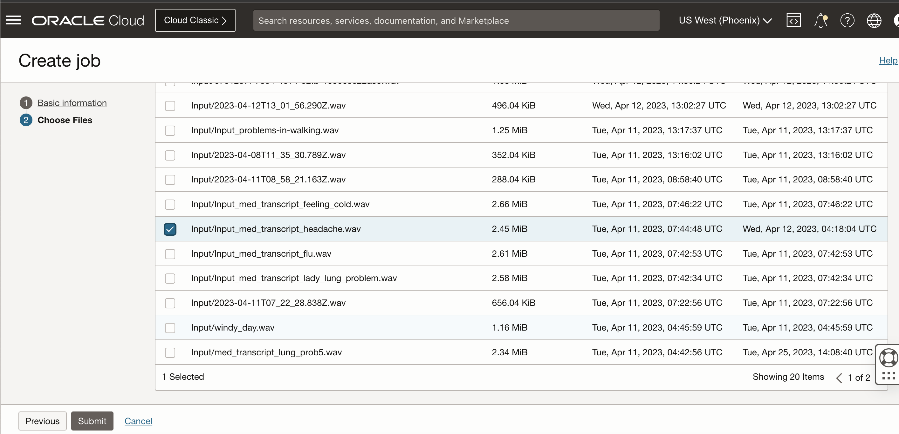
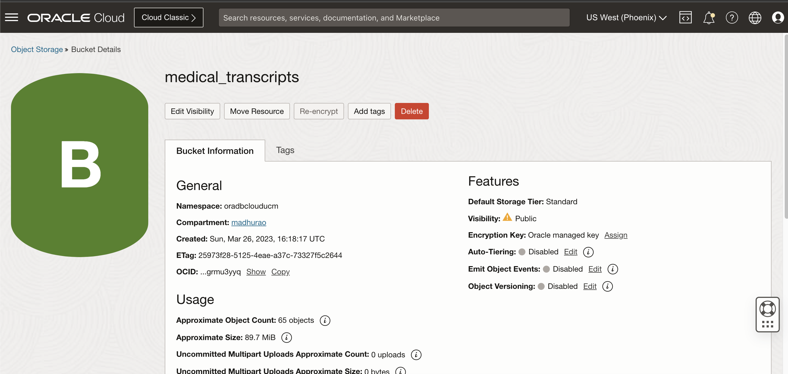

# Create Speech Transcription Job

## Introduction

In this lab, we will walk you through uploading an audio file into OCI object storage, creating a Speech transcription job and reviewing the transcription output in JSON and SRT formats. This Speech to Text content becomes an input for Cohere AI, and it responds with an AI message.

In the Healthcare world, this finds two use cases: one in Medical Transcription, where hospitals typically receive voice files dictating medical documents from healthcare providers or audio messages from patients. The voice files are converted into text files, which can be further processed by emailing concerned doctors or patients.

The other use case is when patients can ask virtual doctors about their health symptoms and receive medical suggestions from a virtual AI doctor. 
 
Estimated time: 20 minutes

### Objectives

In this workshop, you will learn how to:

* Generate Audio File
* Upload Audio file to OCI Bucket 
* Create Speech Transcription Job
* Review Transcription Job Output in JSON and .SRT files
   
### Prerequisites (Optional)
 
This lab assumes you have:

* Completed **Setup environment** and **Setup OCI CLI** lab and already logged into OCI console

> **Note:** You are at the beginning of **Part 3** Labs.
 
**AI Speech to Text or OCI Speech**.  

OCI Speech is an AI service that applies automatic speech recognition technology to transform audio-based content into text. Developers can easily make API calls to integrate OCI Speech’s pretrained models into their applications. OCI Speech can be used for accurate, text-normalized, time-stamped transcription via the console and REST APIs as well as command-line interfaces or SDKs. You can also use OCI Speech in an OCI Data Science notebook session. With OCI Speech, you can filter profanities, get confidence scores for both single words and complete transcriptions, and more.

**Prebuilt acoustic and language models**
OCI Speech uses automatic speech recognition, a deep learning process, to derive accurate transcription from natural conversations. Get started easily by using prebuilt acoustic and language models that don’t require users to have data science experience.

**Analyze data from audio and video files**
Search, index, and decipher data buried in your audio files. Convert recorded audio conversations to textual data to analyze with AI services. For example, you can use OCI Language to retrieve the sentiment and OCI Speech’s anomaly detection capabilities to identify chances of customer churn.

**Native multilingual support**
OCI Speech ASR models support English, Spanish, and Portuguese, so you can transcribe your audio files in your preferred languages.

**Easy to integrate**
OCI Speech is a versatile service that can be called via REST APIs, different SDKs, and Oracle CLI. Developers can easily deploy a scalable speech service without having data science or ML expertise.
    
## Task 1: Generate Audio File (.wav or .mp3 format)  

1. Use tools such as [Audacity](https://www.audacityteam.org/download/) or Apple QuickTime Player to convert your Audio into .wav or .mp3 files; alternatively, you can also download Audio files from any external sources. 

    
 
## Task 2: Upload Audio file to OCI Bucket

1. On cloud.oracle.com, Navigate to the bucket where you wish to upload the input audio files, select a folder under that bucket, and click the upload button.

    

2. Browse and upload file from your local file system.

    

## Task 3: Create Speech Transcription Job

1. On cloud.oracle.com, Navigate to Analytics & AI, and Select Speech under AI Services
 
    

2. Review the overview tab, and go through the Oracle Documentation links. 

    

3. Click on Jobs and provide basic information. 

    

4. You can also provide a prefix to optional output folder under the selected Bucket.

    

5. Choose OCI Bucket and then select the file which was uploaded. Click on the Submit button.

    

6. The speech transcription job will change from creating status to active status within few seconds.
 
    

    

## Task 4: Review Transcription Job Output in JSON and .SRT files

1. Click on the Active Speech Job for more details.

    

2. Click on Output Bucket

    

3. Download the JSON Output Object

    

    Open the JSON file in a browser like Firefox or any notepad, review the JSON structure.

    

4. Rename the .srt to .txt file and open it in any text editor.

    
   
## Learn More

[Speech Transcription Jobs](https://docs.oracle.com/en-us/iaas/Content/speech/using/create-trans-job.htm) 
 
## Acknowledgements

* **Author** - Madhusudhan Rao B M, Principal Product Manager, Oracle Database
* **Last Updated By/Date** - May 23rd, 2023.