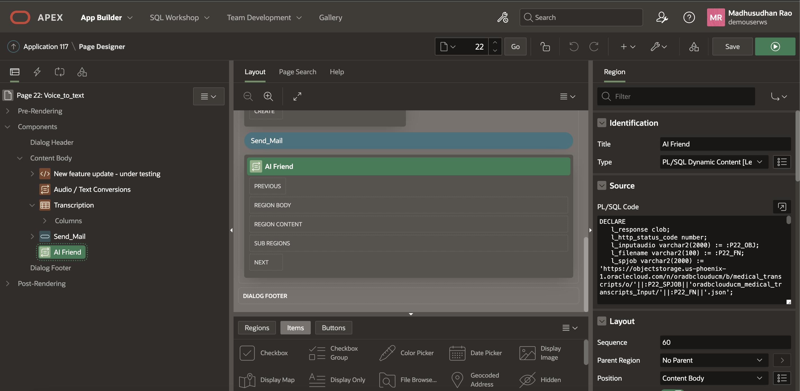
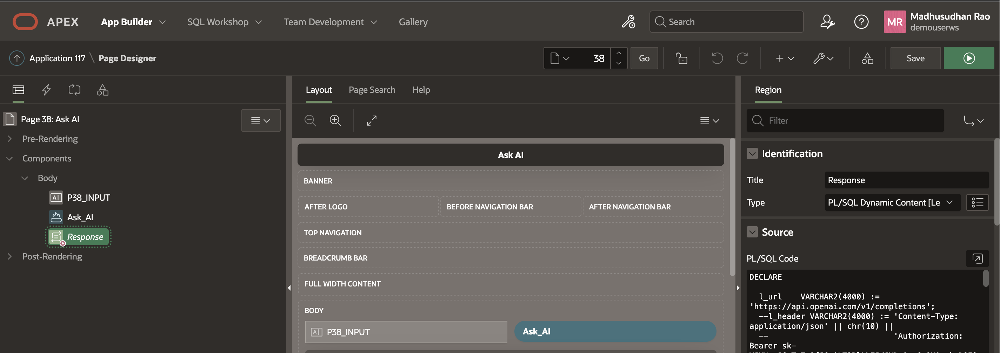

# Lab 14: Oracle Speech and OpenAI Chat GPTs Integration

## Introduction

The OpenAI API can be applied to virtually any task that requires understanding or generating natural language and code. The OpenAI API can also be used to generate and edit images or convert speech into text. OpenAI offer a range of models with different capabilities and price points, as well as the ability to fine-tune custom models.

**GPTs**

OpenAI's GPT (generative pre-trained transformer) models have been trained to understand natural language and code. GPTs provide text outputs in response to their inputs. The inputs to GPTs are also referred to as "prompts". Designing a prompt is essentially how you “program” a GPT model, usually by providing instructions or some examples of how to successfully complete a task. GPTs can be used across a great variety of tasks including content or code generation, summarization, conversation, creative writing, and more. Read more in OpenAI's introductory [GPT guide](https://platform.openai.com/docs/guides/gpt) 

You can ask Questions like 

**First Example**

*please help me with common cold curing*

and OpenAI GPT engine would repond back as 

*1. Get plenty of rest. 2. Drink lots of fluids, such as water, juice, and clear broth. 3. Use saline nose drops to relieve congestion. 4. Sip warm liquids such as broth, tea, or apple cider. 5. Take over-the-counter medications such as ibuprofen or acetaminophen to reduce fever and aches. 6. Use a humidifier or take a warm, steamy shower to help ease congestion. 7. Gargle with warm salt water to soothe a sore throat. 8. Avoid contact with people who have colds. 9. Avoid smoking and secondhand smoke. 10. Increase your vitamin C intake.*

**Another Example**

*help me detect breast cancer please*

OpenAI would respond back as 

*1. Make an appointment with your doctor for a physical exam. 2. Ask your doctor to perform a breast exam to check for lumps. 3. Get regular mammograms as recommended for your age. 4. Talk to your doctor about other possible tests, such as a breast MRI or ultrasound. 5. Pay attention to any changes in your breasts, such as a lump or thickening, discharge, or nipple inversion. 6. Consider genetic testing if you have a family history of breast cancer.*
 
Estimated Time: 20 minutes.
  
### Objectives

In this lab, you will:

* Create OpenAI Key
* Understand OpenAI Authentication  
* Integrating Oracle Speech AI Output with OpenAI
* OpenAI Integration with Oracle APEX without using OCI Speech AI


### Prerequisites

This lab assumes you have:

* Completed previous labs of this workshop.
* You have an Oracle APEX workspace already created.

## Task 1: Create OpenAI Key

Create an Account at OpenAI and Create a Key at [OpenAI](https://platform.openai.com/account/api-keys).
  

  
## Task 2: Understand OpenAI Authentication 

If you want to specifically enable OpenAI plugins to work with your API, you can provide a client secret during the plugin installation flow. This means that all traffic from OpenAI plugins will be authenticated but not on a user level. This flow benefits from a simple end user experience but less control from an API perspective.

* To start, select "Develop your own plugin" in the ChatGPT plugin store, and enter the domain where your plugin is hosted.
* In ai-plugin.json, set auth.type to "service_http" as is shown in our service level auth example.
* You will be prompted for your service access token, which is a string specified in your code.
    * We securely store an encrypted copy of your service access token to enable plugin installation without additional authentication.
    * The service access token is sent in the Authorization header for plugin requests.
* Once you add your service access token into the ChatGPT UI, you will be presented with a verification token.
* Add the verification token to your ai-plugin.json file under the auth section as shown Python code below.

```python
    <copy>
        "auth": 
        {
        "type": "service_http",
        "authorization_type": "bearer",
            "verification_tokens": {
                "openai": "OpenAI's Key"
            }
        } 
    </copy>
    ```

**OAuth**

Below is an example of what the OAuth configuration inside of the ai-plugin.json file might look like:

```json
<copy>
        "auth": {
                "type": "oauth",
                "client_url": "https://example.com/authorize",
                "scope": "",
                "authorization_url": "https://example.com/auth/",
                "authorization_content_type": "application/json",
                "verification_tokens": {
                    "openai": "OpenAI's Key"
                }
            }
</copy>
```
 
## Task 3: Integrating Oracle Speech AI Output with OpenAI

Create PL/SQL Dynamic Web Content



```sql
    <copy>
        DECLARE 
        l_response clob;
        l_http_status_code number;
        l_inputaudio varchar2(2000) := :P22_OBJ;
        l_filename varchar2(100) := :P22_FN;
        l_spjob varchar2(2000) := 'https://objectstorage.us-phoenix-1.oraclecloud.com/n/your-namespace/b/your-bucket/o/'||:P22_SPJOB||'your-namespace_your-bucket_Input/'||:P22_FN||'.json';
        l_url    varchar2(1000) := 'https://api.openai.com/v1/completions'; 
        l_input varchar2(4000) := 'What is cancer?';
        l_body   varchar2(4000); 
        l_response_json CLOB;
        l_text varchar2(4000);
        l_text2 varchar2(4000);

        CURSOR C1  IS 
        SELECT jt.* 
        FROM   JSON_TABLE(l_response, '$' 
                COLUMNS (transcription VARCHAR2(2000)  PATH '$.transcriptions[0].transcription' )) jt; 

        CURSOR C2  IS 
        SELECT jt.* 
        FROM   JSON_TABLE(l_response_json, '$' 
                COLUMNS (text VARCHAR2(2000)  PATH '$.choices[0].text' )) jt; 

        
        
    BEGIN 
        apex_web_service.g_request_headers.delete(); 
        apex_web_service.g_request_headers(1).name  := 'Content-Type'; 
        apex_web_service.g_request_headers(1).value := 'application/json';  

        l_response := apex_web_service.make_rest_request(    
        p_url => l_spjob,
        p_http_method => 'GET' 
        ); 

        -- write speach AI json response to rest collection --
        l_http_status_code := apex_web_service.g_status_code; 
        if l_http_status_code = 200 then 
        apex_collection.create_or_truncate_collection( 'REST_COLLECTION' ); 
        apex_collection.add_member( 
            p_collection_name => 'REST_COLLECTION', 
            p_clob001 =>         l_response  ); 
        end if;     

        -- From rest collection get speech AI text 
        -- (Audio to Text converted by Speech AI Transcription Job) --
        For row_1 In C1 Loop
            l_text := row_1.transcription; 
        End Loop;

        -- Authenticate against OpenAI 
        -- Replace your-openAI-key below
        apex_web_service.g_request_headers(1).name := 'Content-Type';
        apex_web_service.g_request_headers(1).value := 'application/json';
        apex_web_service.g_request_headers(2).name := 'Authorization';
        apex_web_service.g_request_headers(2).value := 'Bearer sk-your-openAI-key';

        -- Construct the body --
        l_body := '{
                    "model": "text-davinci-003",
                    "prompt": "'||l_text||'",
                    "temperature": 0.7,
                    "max_tokens": 128,
                    "top_p": 1,
                    "frequency_penalty": 0,
                    "presence_penalty": 0
                    }'; 

        if l_text is not null then 

        -- Invoke OpenAI service -- 
        l_response_json := apex_web_service.make_rest_request( 
            p_url => l_url, 
            p_http_method => 'POST', 
            p_body => l_body  
        );

        -- Print OpenAI response --
        For row_2 In C2 Loop
                l_text2 := row_2.text;
                Htp.p(  '<b>AI Response </b>'|| l_text2 );  
            End Loop;

        end if; 

        -- Thats all folks --
    END;
    </copy>
    ```


## Task 4: OpenAI Integration with Oracle APEX without using OCI Speech AI
 
Create PL/SQL Dynamic Content



1st example


2nd example


```sql
    <copy>
    DECLARE

    l_url   varchar2(4000) := 'https://api.openai.com/v1/completions'; 
    l_input varchar2(4000) := :P38_INPUT;
    l_body  varchar2(4000) := '{
                "model": "text-davinci-003",
                "prompt": "'||l_input||'",
                "temperature": 0.7,
                "max_tokens": 256,
                "top_p": 1,
                "frequency_penalty": 0,
                "presence_penalty": 0
                }'; 
    l_response_json CLOB;
    l_text varchar2(4000);

    CURSOR C1  IS 
        SELECT jt.* 
        FROM   JSON_TABLE(l_response_json, '$' 
                COLUMNS (text VARCHAR2(2000)  PATH '$.choices[0].text' )) jt; 

    BEGIN

    if l_input is not null then

            apex_web_service.g_request_headers(1).name := 'Content-Type';
            apex_web_service.g_request_headers(1).value := 'application/json';
            apex_web_service.g_request_headers(2).name := 'Authorization';
            apex_web_service.g_request_headers(2).value := 'Bearer sk-your-openai-key';

            l_response_json := apex_web_service.make_rest_request( 
            p_url => l_url, 
            p_http_method => 'POST', 
            p_body => l_body  
            );
            

            For row_1 In C1 Loop
                    l_text := row_1.text;
                    Htp.p(  l_text );  
            End Loop;

        end if;

    END; 
    </copy>
    ```

 
This concludes this lab and you can **proceed to the next lab**.

## Learn More

* [OpenAI Authentication](https://platform.openai.com/docs/plugins/authentication/oauth) 
* [API Reference Guide](https://platform.openai.com/docs/api-reference)
* [JSON Developer Guide](https://docs.oracle.com/en/database/oracle/oracle-database/19/adjsn/function-JSON_TABLE.html#GUID-0172660F-CE29-4765-BF2C-C405BDE8369A)

## Acknowledgements
* **Author** - Madhusudhan Rao B M, Principal Product Manager, Oracle Database
* **Last Updated By/Date** - May 23rd, 2023.