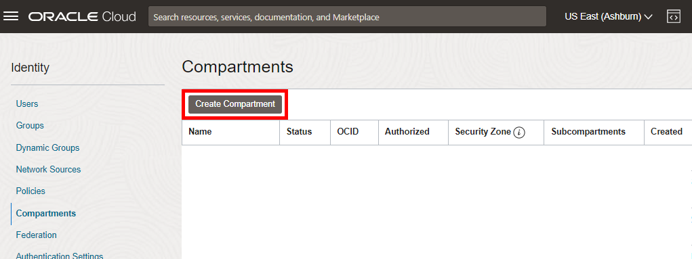
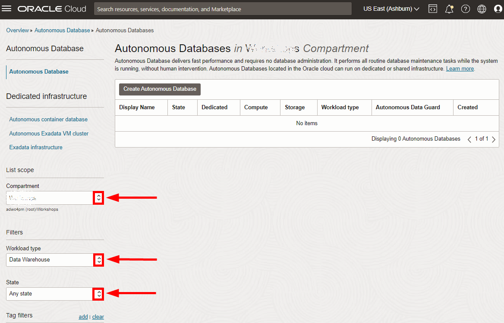
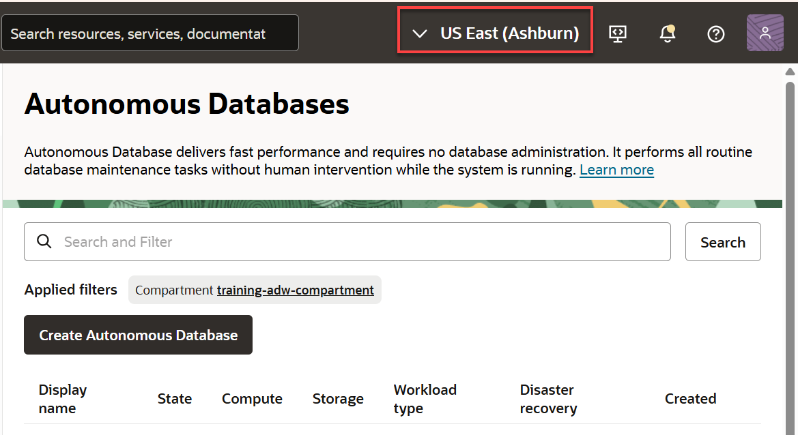

# Create an Oracle Autonomous Database 

## Introduction

Learn how to provision Autonomous Database using the OCI console.

Estimated Time: 5 minutes

### Objectives

In this lab, you will:

- Learn how to provision a new OracleAutonomous Database

### Prerequisites

- This lab requires completion of the Get Started section in the Contents menu on the left.

## Task 1: Create or select a compartment
 
A compartment is a collection of cloud assets, like compute instances, load balancers, databases, and so on. By default, a root compartment was created for you when you created your tenancy (for example, when you registered for the trial account). It is possible to create everything in the root compartment, but Oracle recommends that you create sub-compartments to help manage your resources more efficiently.

If you are using an Oracle LiveLabs-provided sandbox, you don't have privileges to create a compartment and should skip this first task. Oracle LiveLabs has already created a compartment for you and you should use that one. Even though you can't create a compartment, you can review the steps below to see how it is done.

> **Note:**  If you already have a compartment created, you can **optionally skip this Task**.

1. Click the three-line menu on the top left of the console. Scroll down to the bottom of the menu, click **Identity & Security -> Compartments**.

    

    Then, click the **Create Compartment** button to create a sub-compartment.

    

2. Give the compartment a name and description. Be sure your root compartment appears as the parent compartment. Press the blue **Create Compartment** button.

    

    The compartment is created and you can use it for your cloud services!

## Task 2: Choose Autonomous Database from the OCI services menu
 
1. Once logged into Oracle Cloud, click the navigation menu in the upper left to show top level navigation choices:

    

    Then, select **Oracle Database -> **:   

    

2. You can use the List Scope fields on the left to control the list of Autonomous Databases that are displayed. This is useful when you are managing many Autonomous Databases:

    

    - **Compartment**: OCI resources are organized into compartments. Select the compartment where you want to create your Autonomous Database. <if type="livelabs">To quickly locate the compartment that has been assigned to you for this workshop, enter the first part of your user name (e.g. `LL185`) in the Search Compartments field.</if>
    - **Workload Type**: Filter the Autonomous Database list by selecting your workload type. Select *All* to view all databases
    - **State**: View databases that are available, stopped, terminated and more.

<if type="freetier">

   > **Note:** Avoid the use of the `ManagedCompartmentforPaaS` compartment as this is an Oracle default used for Oracle Platform Services.

</if>

<if type="freetier">
3. If you are using a Free Trial or Always Free account, and you want to use Always Free Resources, you need to be in a region where Always Free Resources are available. You can see your current default **region** in the top, right hand corner of the page.

    
</if>

## Task 3: Create the Autonomous Database instance
 
1. Click **Create Autonomous Database** to start the instance creation process.

    

2.  This brings up the **Create Autonomous Database** screen where you will specify the configuration of the instance.

    

3. Give basic information for the autonomous database:

<if type="freetier">
    - **Choose a compartment** - Select the compartment you just created.
    - **Display Name** - Enter a memorable name for the database for display purposes. For this lab, use ****.
    - **Database Name** - Use letters and numbers only, starting with a letter. Maximum length is 14 characters. (Underscores not supported.) For this lab, use ****.

    
</if>
<if type="livelabs">
    - **Choose a compartment** - Use the default compartment created for you.
    - **Display Name** - Enter a memorable name for the database for display purposes. For this lab, use ****.
    - **Database Name** - Use letters and numbers only, starting with a letter. Maximum length is 14 characters. (Underscores not supported.) For this lab, use ****, for example, ****.

    
</if>

4. Choose a workload type. Select the workload type for your database from the choices:

    - **Data Warehouse** - designed to support all standard SQL and business intelligence (BI) tools, and provides all of the performance of the market-leading Oracle Database in an environment that is tuned and optimized for data warehouse workloads
    - **Transaction Processing** - provides all of the performance of the market-leading Oracle Database in an environment that is tuned and optimized to meet the demands of a variety of applications, including: mission-critical transaction processing, mixed transactions and analytics, IoT, and JSON document store
    - **JSON Database** - is Oracle Autonomous Transaction Processing, but designed for developing NoSQL-style applications that use JavaScript Object Notation (JSON) documents. You can store up to 20 GB of data other than JSON document collections. There is no storage limit for JSON collections.
    - **APEX** - is a low cost, Oracle Cloud service offering convenient access to the Oracle APEX platform for rapidly building and deploying low-code applications

    For this workshop, choose **Data Warehouse**.

    

5. Choose a deployment type. Select the deployment type for your database from the choices:

    - **Shared Infrastructure** - For this lab, choose **Shared Infrastructure** as the deployment type.
    - **Dedicated Infrastructure**

    

6. Configure the database:

    - **Always Free** - If your Cloud Account is an Always Free account, you can select this option to create an always free autonomous database. An always free database comes with 1 OCPU and 20 GB of storage. For this lab, we recommend you leave Always Free unchecked.
    - **Choose database version** - Select **19c** as the database version.
    - **OCPU count** - Number of OCPUs for your service. For this lab, specify ****. If you choose an Always Free database, it comes with 1 OCPU.
    - **Storage (TB)** - Select your storage capacity in terabytes. For this lab, specify **** of storage. Or, if you choose an Always Free database, it comes with 20 GB of storage.
    - **OCPU auto Scaling** - For this lab, keep auto scaling enabled, to enable the system to automatically use up to three times more OCPU and IO resources to meet workload demand.
    - **Storage auto scaling** - For this lab, there is no need to enable storage auto scaling, which would allow the system to expand up to three times the reserved storage.

    > **Note:** You cannot scale up/down an Always Free autonomous database.

    

7. Create administrator credentials:

    - **Password and Confirm Password** - Specify the password for ADMIN user of the service instance. The password must meet the following requirements:
    - The password must be between 12 and 30 characters long and must include at least one uppercase letter, one lowercase letter, and one numeric character.
    - The password cannot contain the username.
    - The password cannot contain the double quote (") character.
    - The password must be different from the last 4 passwords used.
    - The password must not be the same password that you set less than 24 hours ago.
    - Re-enter the password to confirm it. Make a note of this password.

    

8. Choose network access:
    - For this lab, accept the default, **Secure access from everywhere**.
    - If you want to allow traffic only from the IP addresses and VCNs you specify - where access to the database from all public IPs or VCNs is blocked, select **Secure access from allowed IPs and VCNs only** in the Choose network access area.
    - If you want to restrict access to a private endpoint within an OCI VCN, select **Private endpoint access only** in the Choose network access area.
    - If the **Require mutual TLS (mTLS) authentication** option is selected, mTLS will be required to authenticate connections to your Autonomous Database. TLS connections allow you to connect to your Autonomous Database without a wallet, if you use a JDBC thin driver with JDK8 or above. See the [documentation for network options](https://docs.oracle.com/en/cloud/paas/autonomous-database/adbsa/support-tls-mtls-authentication.html#GUID-3F3F1FA4-DD7D-4211-A1D3-A74ED35C0AF5) for options to allow TLS, or to require only mutual TLS (mTLS) authentication.

    

9. Choose a license type. <if type="freetier">For this lab, choose **License Included**.</if><if type="livelabs">For this lab, choose **Bring Your Own License (BYOL)**.</if> The two license types are:
    - **Bring Your Own License (BYOL)** - Select this type when your organization has existing database licenses.
    - **License Included** - Select this type when you want to subscribe to new database software licenses and the database cloud service.

<if type="freetier">
    
</if>
<if type="livelabs">
    
</if>

10. For this lab, do not provide a contact email address. The "Contact Email" field allows you to list contacts to receive operational notices and announcements as well as unplanned maintenance notifications.

    

11. Click **Create Autonomous Database**.

12.  Your instance will begin provisioning.

    

    In a few minutes, the state will turn from Provisioning to Available. At this point, your Autonomous Database instance is ready to use! Have a look at your instance's details - including its name, database version, OCPU count, and storage size.

    

## Task 4: Create an Oracle APEX Workspace

1. Once the ADB has been fully provisioned, return to the *Autonomous Database* page, locate the instance's display name, and then click on it to view the ADB's details page. Click the *Tools* tab. 
2. Click the *Copy* button to copy the URL to launch the Oracle APEX development environment. Open the link in a new browser window or tab.

3. For new ADB instances, this should launch the *Administration Services* login screen. Enter the password for the *admin* user and click the *Sign In to Administration* button.

4. Again, for new ADB instances, after a successful login, the browser will redirect to the page shown below. Click the *Create Workspace* button.

5. Click and select the *New Schema* option.

6. Enter the desired *Workspace Name* and *Workspace Username*. The latter will be used to create an Oracle Database user account. Also, provide a new *Workspace Password* that conforms to the same password policy described in *Task 1*. Click the *Create Workspace* button to create the workspace.

7. After the workspace has been successfully provisioned, click the button on the top-right, and then click the *Sign out* button to return to the App Builder login screen.

8. Enter the workspace name, username, and password set earlier when creating the workspace. Click the *Sign In* button to access the newly created workspace.

9. After successful authentication, the browser will redirect to the default App Builder landing page where workspace administrators and developers will have access to various functionalities to develop and manage APEX applications.

  
You may now **proceed to the next lab**.

## Learn more

- See the [documentation](https://docs.oracle.com/en/cloud/paas/autonomous-data-warehouse-cloud/user/autonomous-workflow.html#GUID-5780368D-6D40-475C-8DEB-DBA14BA675C3) on the typical workflow for using Autonomous Data Warehouse.
- Go to the [Data Warehousing Insider blog](https://blogs.oracle.com/datawarehousing/) for more information on network connectivity options mentioned in this workshop.

## Acknowledgements

- **Author** - Nilay Panchal, Oracle Autonomous Database Product Management
- **Adapted for Cloud by** - Richard Green, Principal Developer, Database User Assistance
- **Last Updated By/Date** - Madhusudhan Rao on 9th Aug 2023