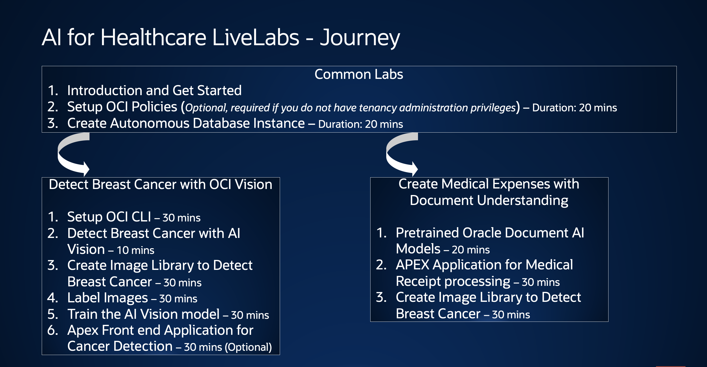
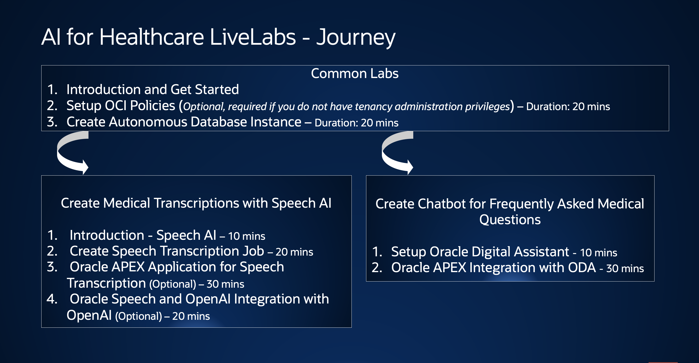
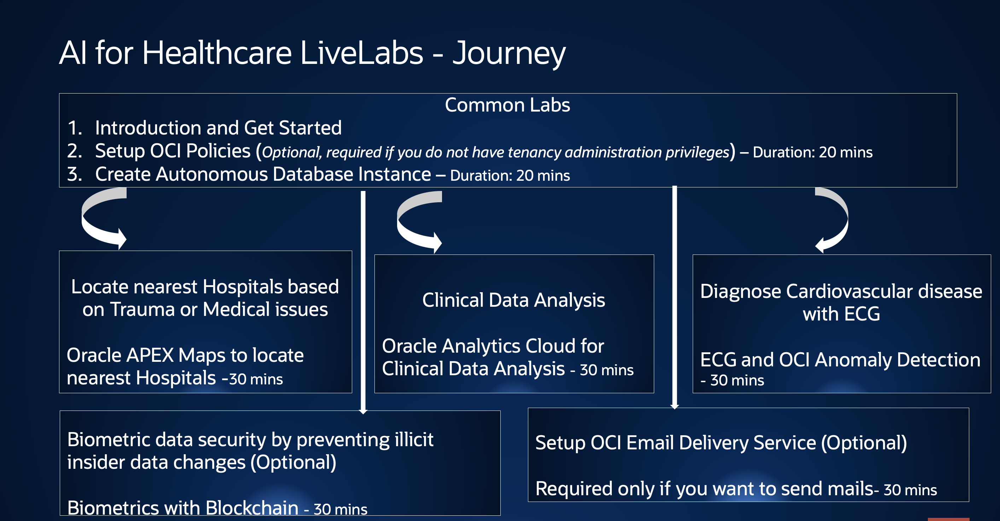

# Introduction

## About this workshop

Machine Learning and Artificial Intelligence tools are unprecedentedly changing modern healthcare. Given the speed of innovation and global outreach, it can be challenging for patients and healthcare providers to stay abreast of the latest technological advances and how they will impact the future. 

In this workshop, we will show how Artificial Intelligence (AI) and Machine Learning (ML) are helping identify breast cancer using Oracle APEX, Oracle AI Vision Service, and Oracle Autonomous Database.  

We’ll share how we trained our AI Machine learning models with X-Ray mammography images to identify breast cancers and even incorporated many other features, such as helping doctors or patients dictate medical symptoms and diagnoses quickly by sending an email of the audio message and the medical transcription text. 
  
### AI for Healthcare - Complete Demo and Architecture video

[Youtube video on AI for Healthcare Demo](youtube:iBV76Upi1VM:large)

### AI for Healthcare Demo - with Patient Admission Process (extended demo)

[Youtube video on AI for Healthcare Demo](youtube:ok-fYO0CV2I:large)

### Introduction video

[Youtube video on AI for Healthcare Demo](youtube:VjeoHU4I6SI:large)

*Estimated Workshop Time: 16 hours (Approximately)*

### Prerequisites 
 
This lab assumes you have:

* An Oracle account
* Basic Developer Knowledge of Oracle APEX and Oracle PL/SQL
 
[**AI for Healthcare**](https://en.wikipedia.org/wiki/Artificial_intelligence_in_healthcare) Learn about the latest innovations in Healthcare, Detect Breast Cancer and Lung Cancer using [**OCI Vision**](https://www.oracle.com/in/artificial-intelligence/vision/) at an early stage. Detect Cardiovascular disease with Electrocardiogram (ECG) Reports and [**OCI Anomaly Detection**](https://www.oracle.com/in/artificial-intelligence/anomaly-detection/). Use the power of [**OCI Document Understanding**](https://www.oracle.com/in/artificial-intelligence/document-understanding/) to submit medical expenses, or using [**OCI Speech**](https://www.oracle.com/in/artificial-intelligence/speech/), ask a doctor about specific medical symptoms and get a response from a virtual Doctor leveraging the power of [**OpenAI**](https://openai.com/). Chat with a virtual doctor through [**Oracle Digital Assistant**](https://www.oracle.com/chatbots/), asking questions related to Breast cancer or Lung cancer or Covid and how to diagnose them. Analyze complex clinical data or genome sequences with [**Oracle Analytics Cloud**](https://www.oracle.com/in/business-analytics/analytics-platform/) or locate the nearest Hospital with [**Oracle Spatial and Maps**](https://www.oracle.com/in/database/spatial/) and contact them.[**Oracle Blockchain**](https://www.oracle.com/blockchain/) for Biometric data security by preventing illicit insider data changes. and much more. 

Running on top of the world's most powerful database, [**Oracle Autonomous Database**](https://www.oracle.com/in/autonomous-database/) and Low Code development platform [**Oracle APEX**](https://apex.oracle.com/en/)

### AI for Healthcare - Technology Architecture

### AI for Healthcare - Learning path

Learning paths are independent of each other, for example after completing common labs you can directly work on AI Vision or Document Understanding Labs. most of the labs are Optional and independent of each other.

Learning path for creating a medical transcription or a chatbot are independent of each other.

Learning path for APEX based Analytics are independent with Oracle Analytics cloud Data Visualization and Working with Blockchain or Anomaly Detection. Setting up email services is required if you plan to send emails from Oracle APEX application.

Learning path for Patient Admission Process requires a completely working Breast cancer detection workshops to be completed. you can skip other labs and directly work on Oracle Integration cloud and Process Automation.

 
### AI for Healthcare - Table of Contents
 
*Common Labs - Introduction Lab to Lab 3*

These are common labs that are required for most of the other labs under this workshop.

* Introduction
    * About the workshop
    * Table of Contents
    * About Breast Cancer
* Get Started
    * Sign-in to Oracle [cloud web console](cloud.oracl.com)
* Lab 1: Setup [**OCI Policies**](https://docs.public.oneportal.content.oci.oraclecloud.com/en-us/iaas/Content/Identity/access/manage-accessresources.htm) 

 *Setting up Policies is required if you need administrative access in your tenancy.*

    * Create OCI Bucket
    * Create a new compartment
    * Setup policies for Compartment management
    * Setup policies for OCI Data Labeling
    * Setup policies for OCI Vision service
    * Setup policies for OCI Document Understanding Service
    * Setup policies for OCI Speech
    * Setup policies for OCI Anomaly Detection
* Lab 2: Provision of an [**Oracle Autonomous Database**](https://www.oracle.com/in/autonomous-database/)
    * Create or select a compartment
    * Choose Autonomous Database from the OCI services menu
    * Create the Autonomous Database instance
* Lab 3: Setup OCI [**Command Line Interface (CLI)**](https://docs.oracle.com/en-us/iaas/Content/API/Concepts/cliconcepts.htm)
    * Get the User's OCID
    * Add User's API Key
    * Generate and Download RSA Key Pair in PEM format
    * Install OCI Command Line Interface
    * Update OCI Configuration file
    * List all Buckets in a Compartment using OCI CLI

*Detect Breast Cancer - Lab 4 to Lab 8*

These Labs will guide you in detecting Breast Cancer using [**OCI Vision**](https://www.oracle.com/in/artificial-intelligence/vision/) AI Service.

* Lab 4: Understanding Mammography and Breast Cancer (<u>Optional Lab</u>)
    * What is a Mammogram?
    * What does Breast Cancer look like on a Mammogram?
    * Other Breast abnormalities
    * Normal Breast Mammogram 
    * Breast Cancer Mammogram
* Lab 5: Create an Image Library to Detect Breast Cancer
    * Data Preparation by Classifying Images. 
    * Load images to Object Storage using OCI CLI
    * Verify images are correctly loaded
* Lab 6: Label Images
    * Generate dataset records using [**OCI Data Labeling**](https://www.oracle.com/in/artificial-intelligence/data-labeling/) for Breast Cancer
    * Bulk image labelling
    * Verify Bulk Data labelled images
* Lab 7: Train the model using the **Image Classification** AI model
    * Create OCI Vision Project
    * Create and Train OCI AI vision model
    * Analyze and evaluate your model
    * Review Request and Response JSON
* Lab 8: [**Oracle APEX**](https://apex.oracle.com/en/) Application for Breast Cancer Detection
    * Setup Oracle APEX Web Credentials
    * Create required schema - 
        * Tables: MACHINE LEARNING CONFIGS, VISION AI DOCS, VISION AI FIELDS
        * PL/SQL Procedure IMAGE\_AI\_PK, Triggers etc.
    * Create Oracle APEX Page
    * Verify Oracle APEX File upload settings
    * Display results

*Create Medical Expenses - Lab 9 to Lab 10* 

These Labs will guide you in creating medical expenses using Oracle [**OCI Document Understanding**](https://docs.oracle.com/en-us/iaas/document-understanding/document-understanding/using/home.htm) AI Service.

* Lab 9: Introduction to Pretrained Oracle Document AI Models
    * Text Extraction
    * Table Extraction
    * Key Value Extraction
    * Document classification
    * Analyze the request and response JSON files
* Lab 10: Oracle APEX Application for Medical Receipt Processing
    * Setup Oracle APEX Web Credentials
    * Create required schema - 
        * Tables: MACHINE LEARNING CONFIGS, DOCUMENT AI DOCS, DOCUMENT AI FIELDS
        * PL/SQL Procedure DOCUMENT\_AI\_PK, Triggers etc.
    * Create Oracle APEX Page
    * Verify Oracle APEX File upload settings
    * Create Custom Reports and Verify the results of the uploaded receipt file.
    * Create an Expense item from the uploaded receipt.
 
*Create Medical Transcriptions - Lab 11 to Lab 13* 

These Labs will guide you in creating medical transcription and consulting virtual AI doctors using Oracle [**OCI Speech**](https://www.oracle.com/in/artificial-intelligence/speech/) AI Service.

* Lab 11: Introduction - Speech AI
    * AI Speech to Text or OCI Speech.
    * Analyze data from audio and video files.
* Lab 12: Create Speech Transcription Job
    * Generate Audio File
    * Upload an Audio file to OCI Bucket
    * Create Speech Transcription Job
    * Review Transcription Job Output in JSON and .SRT files 
* Lab 13: Oracle APEX Application for Speech Transcription
    * Setup Oracle APEX Web Credentials
    * Create required schema - 
        * Tables: MACHINE LEARNING CONFIGS, SPEECH AI DOCS, SPEECH AI FIELDS
        * PL/SQL Procedure SPEECH\_AI\_PK, Triggers etc.
    * Create Oracle APEX Page
    * Verify Oracle APEX File upload settings
    * Upload the audio file from the local file system to the OCI object storage bucket using OCI Object storage rest APIs.
    * Create Speech Transcription Job
    * Review the audio file and Transcribed text content of the Audio file.

*Oracle APEX and OpenAI Chat GPTs Integration - Lab 14*

These labs will show how to integrate [**Oracle APEX**](https://apex.oracle.com/en/) Application with [**OpenAI**](https://openai.com/) REST APIs or [**Cohere**](https://cohere.com/).

* Lab 14: Oracle Speech and OpenAI Integration
    * Create OpenAI Key
    * Understand OpenAI Authentication  
    * Integrating Oracle Speech AI Output with OpenAI
    * OpenAI Integration with Oracle APEX without using OCI Speech AI
    * Create Cohere Key (Optional Tasks)
    * Getting AI Response from Cohere (Optional Tasks)

*Create Chatbot for Frequently Asked Medical Questions - Lab 15 - Lab 16*

These labs will show users to interact with [**Oracle Digital Assistant**](https://www.oracle.com/in/chatbots/) Chatbot with frequently asked questions related to cancer or COVID, Pneumonia or any other health issues and get medical advice on time.

* Lab 15: Setup Oracle Digital Assistant
    * Oracle Digital Assistant for [**natural language processing(NLP)**](https://en.wikipedia.org/wiki/Natural_language_processing), [**natural language understanding**](https://en.wikipedia.org/wiki/Natural-language_understanding) (NLU) 
    * Provision Oracle Digital Assistant from OCI services
    * Create Oracle Digital Assistant Skill 
    * Adding Knowledge documents for Frequently asked questions (FAQs)
    * Train the ODA Model
    * Preview the Model and Skill
    * Add AutoComplete Suggestion and Utterances.
    * Create a Web Channel for a Skill
* Lab 16: Oracle APEX Integration with ODA
    * Download ODA Oracle Native Client SDK
    * Get channel id from the ODA console
    * Configure settings.js file
    * Upload CSS, Image and JS files to Oracle APEX 
    * HTML Code to add ODA chatbot on an Oracle APEX page
    * Bot Initiated Conversation
    * Update YAML flow in ODA
    * Demo of Chatbot in Oracle APEX Page

*Oracle APEX Maps and Spatial queries to locate nearest Hospitals - Lab 17*

These labs will walk you through the steps of locating Hospitals based on location and patient trauma 

* Oracle APEX Maps and [**Oracle Spatial**](https://www.oracle.com/in/database/spatial/) queries to locate the nearest Hospitals
    * Create the required schema
    * Update SDO_GEOMETRY Column
    * Create Oracle APEX Faceted Search
    * Create Oracle APEX Map and Map Layer
    * Demo of finding Hospital on Map based on Location and Trauma selected.
    * Query to locate the nearest Hospital within a given radius

*Oracle Analytics Cloud for Clinical Data Analysis - Lab 18*

These labs will walk you through the steps of creating an [**Oracle Analytics cloud**](https://www.oracle.com/in/business-analytics/analytics-platform/) instance, creating Analytics reports or Data Visualization and making these reports available in Oracle APEX Application. We will take the example of Analysing Clinical Data, but there are limitless opportunities to Analyse Healthcare Data using Oracle Analytics cloud

* Oracle Analytics Cloud for Clinical Data Analysis
    * Create Oracle Analytics Cloud Instance
    * Log in to Oracle Analytics Cloud Instance
    * Setup Autonomous Database Connection
    * Create New Dataset from Table
    * Create Data Visualization
    * View reports in Designer Mode
    * Copy Analytics Report Embed URLs
    * Embed Reports in APEX Application

*Diagnose Cardiovascular disease with ECG and OCI Anomaly Detection - Lab 19*

These labs walk you through the steps of detecting Cardiovascular disease with Electrocardiogram (ECG) Reports and [**OCI Anomaly Detection**](https://www.oracle.com/in/artificial-intelligence/anomaly-detection/).

* Diagnose Cardiovascular disease with ECG and OCI Anomaly Detection
    * Approach to ECG Interpretation - ECG Data Preparation
    * Upload the ECG Training data to OCI Object storage
    * Create and Train the ECG Model
    * Review Model and Data settings
    * Detect ECG Anomalies

*Biometrics with Blockchain - Lab 20*

These labs walk you through preventing illicit insider changes to users' biometric data using [**Oracle Blockchain**](https://www.oracle.com/blockchain/). It Permits insert-only SQL operations, with no updates and other modifications allowed, and restricts deletions.

* Biometrics with Blockchain
    * Create a Blockchain table.
    * Insert Biometric data into the blockchain table.
    * Demonstrate Blockchain Data Security. 

*Setup OCI Email Delivery Service - Lab 21*

These labs walk you through the steps of setting up [**OCI Email Services**](https://www.oracle.com/in/cloud/networking/email-delivery/). This will help us email Doctors, Patients or any Health official with the required data. For example, we can email transcribed text to Doctor after the patient uploads an audio file or mail once the medical expenses have been approved or rejected

* Setup OCI Email Delivery Service 
    * Generate SMPT Credentials
    * EMAIL Delivery Configuration
    * Create Approved Sender  
    * Configuring Oracle APEX to Send Email
    * Plain Text only message
    * Plain Text / HTML message
    * Sending Speech Transcription and Audio file link in an Email

*Patient Admission Process after Breast Cancer Detection - Lab 22 to Lab 24*

These labs walk you through the steps of creating Oracle Integration Cloud Integration Service and Process automation for the Patient Admission process.

* Create Get Patient Details Integration - Oracle Integration Cloud 
    * Access Autonomous Database Instance and Download Wallet
    * Log in to Oracle Integration Cloud and Create an Oracle Autonomous Warehouse Database connection
    * Create First Integration to Get Patient Details
    * Create Autonomous Database Connection from Integration Cloud
    * Add Mapper to Map JSON Payload
    * Add Email Notification
    * Activate the Integration and Test the Integration Service
    * View Complete Integration Flow.

In this lab, you will learn how to create Oracle Integration Cloud Integration Service for Updating the Patient Data.

* Create Update Patient Details Integration - Oracle Integration Cloud 
    * Create Second Integration to Update Patient Details
    * Add Database Connection Adapter
    * Add Mapper
    * Send Notification Email
    * Activate and Test Integration.
    * Complete Integration flow.

In this lab you will create end to end patient admission process using Oracle Integration Cloud Generation 2 with Process Automation.

* Complete Process Automation for Patient Admission Process 
    * Create Patient Admission Process Application.
    * Add Human Task as Doctor's Activity
    * Add Human Task as Hospital Administrator's Activity
    * Complete Patient Admission Process
    * The patient consults the Doctor based on the report received.
    * Running the Patient Admission Process in Process Player
    * Patient logs into AI for Healthcare portal to get the latest update
    * Enhanced Patient Admission Process
 
## About Breast Cancer

Breast cancer is the most diagnosed cancer among women worldwide [Breast cancer represents 1 in 4 cancers diagnosed among women globally](https://www.uicc.org/news/globocan-2020-new-global-cancer-data). Colorectal, lung, cervical, and thyroid cancers are also common among women. It is the most frequent cancer amongst both sexes and is the leading cause of death from cancer in women. The estimated 2.3 million new cases indicate that one in every eight cancers diagnosed in 2020 was breast cancer. In 2020, there were an estimated 684,996 deaths from breast cancer, with a disproportionate number of these deaths occurring in low-resource settings.

Breast cancer cells usually form a tumour that can often be seen on an x-ray or felt as a lump. It becomes advanced breast cancer if spread outside the breast through blood vessels and lymph vessels. When breast cancer spreads to other body parts (such as the liver, lungs, bones or brain), it is said to have metastasized and is referred to as metastatic breast cancer. Breast cancer is the most common cancer among women. Breast cancer occurs when some breast cells begin to grow abnormally. These cells divide more rapidly than healthy cells and continue to gather, forming a lump or mass. The cells may spread (metastasize) to the lymph nodes or other body parts. Breast cancer mostly begins with cells in the milk-producing ducts (invasive ductal carcinoma), the glandular tissue called lobules (invasive lobular carcinoma), or other cells or tissue within the breast.

Researchers have identified hormonal, lifestyle and environmental factors that may increase the risk of breast cancer. But it is unclear why some women without risk factors develop cancer, yet others with risk factors never do. It is most likely that a complex interaction of genetic makeup and environmental factors causes breast cancer.
 
 
 
## Important

This workshop provides a basic example of using OCI Vision and other AI services. This example is for illustration and demonstration purposes only and isn't intended to replace any medical imagery analysis tool or official diagnosis recommendation made by a professional. Users need to receive the proper regulated compliance and approvals before using for medical and diagnostic use.

You may now **proceed to the next lab**.
    
## Acknowledgements

* **Architect, Author and Developer** - [Madhusudhan Rao B M](https://www.linkedin.com/in/madhusudhanraobm/), Principal Product Manager, Oracle Database
* **Advisor** - [Bo English-Wiczling](https://www.linkedin.com/in/boenglish/), Senior Direct, Program Management, Oracle Database 
* **Last Updated By/Date** - Aug 9th, 2023
